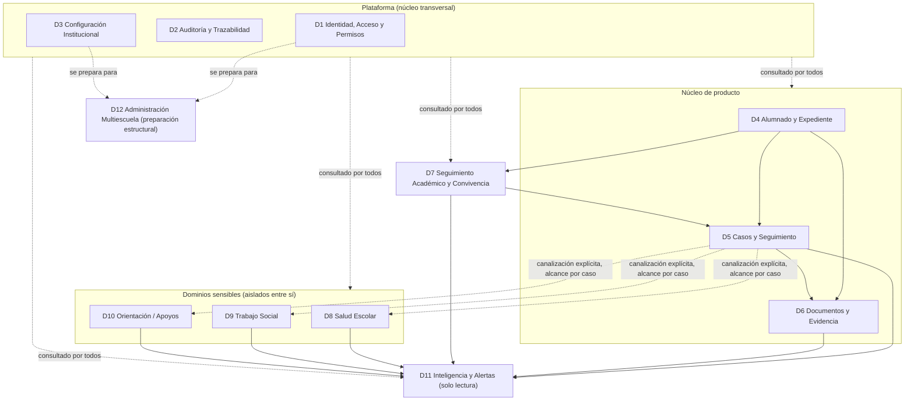
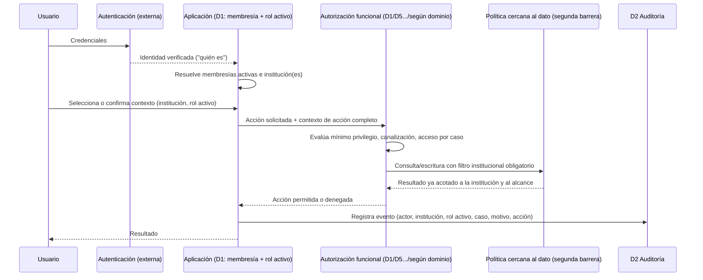

# Arquitectura Lógica — SASE Zero

**Estado:** Propuesta de arquitectura lógica. Ningún stack aprobado. Pendiente de revisión del Product Owner.
**Fuente de precedencia:** [`docs/foundation/PRODUCT_FOUNDATION.md`](../foundation/PRODUCT_FOUNDATION.md); traduce a límites lógicos el [`TECHNICAL_ARCHITECTURE_CONTRACT.md`](TECHNICAL_ARCHITECTURE_CONTRACT.md) §9–§10 y aplica la dirección arquitectónica provisional de [`TECHNICAL_ALTERNATIVES_COMPARISON.md`](TECHNICAL_ALTERNATIVES_COMPARISON.md).
**Se relaciona con:** [`docs/domains/DOMAIN_MAP.md`](../domains/DOMAIN_MAP.md), [`docs/product/MODULE_CATALOG.md`](../product/MODULE_CATALOG.md), [`docs/product/ROLE_MATRIX.md`](../product/ROLE_MATRIX.md), [`docs/product/CORE_WORKFLOWS.md`](../product/CORE_WORKFLOWS.md), [`ADR-0001`](../decisions/ADR-0001-RELACION-CON-TRABAJO-PREVIO.md), [`ADR-0002`](../decisions/ADR-0002-USUARIOS-CON-MULTIPLES-ROLES.md).

Este documento no repite la fundación, la arquitectura funcional ni la comparación de alternativas; los enlaza y los traduce a límites lógicos verificables.

---

## Leyenda

Misma leyenda usada en todo el mapa funcional y técnico: 🟢 hecho aprobado (cita fuente literal), 🔵 inferencia de diseño, 🟡 propuesta (requiere confirmación del Product Owner), ❓ pregunta abierta.

La mayor parte de este documento es 🔵/🟡: traduce a diseño lógico decisiones ya aprobadas (fundación, ADR, cierre funcional, contrato técnico, comparación de alternativas), pero el diseño lógico en sí mismo — límites concretos, entidades conceptuales, capas de autorización, pruebas negativas — no ha sido revisado todavía por el Product Owner.

## 1. Propósito y límites

Esta misión aplica el contrato técnico §9 y produce, como máximo:

- límites de módulos (arquitectura interna del monolito modular);
- modelo conceptual de datos;
- flujo de identidad y autorización;
- estrategia multitenant conceptual, con pruebas negativas explícitas;
- tratamiento de información sensible;
- estrategia de auditoría;
- estrategia de exportación y respaldo;
- diagramas conceptuales;
- riesgos.

**Esta misión no decide ni crea:**

- stack o proveedor concreto (base de datos, identidad, hosting, almacenamiento);
- esquema físico, tablas, columnas, índices o migraciones;
- endpoints, contratos de API o formatos de payload;
- infraestructura de producción;
- código de ningún tipo;
- automatizaciones capaces de afectar casos sensibles.

Toda alternativa técnica sigue siendo la ya comparada; este documento no reabre A–L de `TECHNICAL_ALTERNATIVES_COMPARISON.md` §4, los aplica.

## 2. Método y fuentes aplicadas

Este documento aplica directamente:

- la dirección arquitectónica provisional de la comparación (§9 de ese documento): monolito modular con límites internos explícitos; web responsiva con capacidades PWA progresivas; persistencia relacional administrada con capacidades integradas; identidad mediante modelo híbrido; autorización funcional en la aplicación reforzada por políticas cercanas al dato; aislamiento multitenant inicial por filas compartidas con identificador institucional; auditoría híbrida (eventos append-only para lo sensible); exportación mediante paquete de cierre institucional;
- los doce dominios de `DOMAIN_MAP.md` y su matriz de dependencias;
- los dieciocho módulos de `MODULE_CATALOG.md`;
- la matriz de roles y el principio de rol activo en contexto (`ADR-0002`);
- los seis flujos de `CORE_WORKFLOWS.md`.

Ninguna decisión aquí contradice una fuente de precedencia superior. Donde una traducción a diseño lógico requiere elegir entre variantes razonables no resueltas por una fuente superior, se marca 🟡 y se explica el criterio.

## 3. Límites de módulos — arquitectura interna del monolito modular

Aplica la alternativa elegida en la comparación §4.A: monolito modular con límites internos explícitos, sin separación física de procesos. El límite de módulo aquí descrito es un límite de responsabilidad y de dependencia, no un límite de despliegue.

### 3.1 Agrupación de dominios en límites internos

| Límite interno | Dominios | Regla de dependencia |
|---|---|---|
| **Plataforma (núcleo transversal)** | D1 Identidad/Acceso, D2 Auditoría, D3 Configuración Institucional | No dependen de ningún dominio operativo. Todo módulo de producto los consulta; ninguno es prerrequisito de otro dominio de plataforma. |
| **Núcleo de producto** | D4 Alumnado/Expediente, D5 Casos/Seguimiento, D6 Documentos/Evidencia | Dependen solo de plataforma. Son prerrequisito de los demás dominios operativos. |
| **Operativo extendido** | D7 Seguimiento Académico y Convivencia | Depende de plataforma y de D4; puede originar casos en D5 (relación declarada, no acceso directo a datos internos de D5). |
| **Dominios sensibles con protección especial** | D8 Salud, D9 Trabajo Social, D10 Orientación/Apoyos | Dependen de plataforma y de D4; se relacionan con D5 solo a través de canalización (D5/M7); nunca se leen entre sí de forma directa. |
| **Transversal de solo lectura** | D11 Inteligencia y Alertas | Lee D5–D10; no escribe en ningún otro dominio; no tiene autoridad de decisión (§14 fundación). |
| **Preparación estructural** | D12 Administración Multiescuela | No implementado en esta fase; D1 y D3 deben modelar la institución como entidad de primer nivel para no requerir rediseño al activarlo. |

### 3.2 Reglas de límite obligatorias (🟡 propuesta de diseño lógico)

1. Ningún módulo de un dominio operativo (D4–D10) accede directamente a los datos internos de otro dominio operativo; toda relación entre dominios se expresa por referencia a un identificador (por ejemplo, un caso referencia a un alumno; nunca copia ni reinterpreta su estructura interna).
2. D8, D9 y D10 nunca se leen entre sí de forma directa, ni siquiera por composición de reportes. Toda visibilidad cruzada pasa por una canalización explícita registrada en D5 (M7), con alcance limitado al caso canalizado — nunca al expediente sensible completo (`ADR-0002`, `ROLE_MATRIX.md` D8/D9/D10).
3. D11 es estrictamente de lectura sobre D5–D10. Ninguna alerta puede escribir, cerrar, sancionar ni modificar un registro de otro dominio (§14 fundación, regla explícita de `M17`).
4. D1, D2 y D3 son consultados por todo módulo de producto, pero ningún módulo de producto es requisito para que D1/D2/D3 existan o se configuren.
5. Toda entidad de un dominio operativo (D4–D11) declara su institución de pertenencia como atributo de primer nivel, nunca como dato derivado o inferido — condición necesaria para L (aislamiento multitenant, sección 6).
6. La extracción futura de un dominio a un componente separado (evolución prevista por la comparación §4.A) solo es viable si estas reglas de límite se respetaron desde el inicio; ninguna regla aquí se relaja "temporalmente" para acelerar una entrega.

### 3.3 Diagrama conceptual de límites y dependencias

## 4. Modelo conceptual de datos

Entidades conceptuales por dominio. No son tablas ni definen tipos físicos: describen qué información institucional existe y cómo se relaciona, para que una fase posterior pueda diseñar el esquema físico sin reabrir estas decisiones funcionales.

### 4.1 D1 — Identidad, Acceso y Permisos

**Trazabilidad:** 🟢 D1 (`DOMAIN_MAP.md`), M1 (`MODULE_CATALOG.md`), roles de `ROLE_MATRIX.md` §6, `ADR-0002`; 🔵 entidades conceptuales (Institución, Membresía institucional, Asignación de rol, Contexto de acción) inferidas al traducir D1 a modelo de datos.

- **Institución** — entidad raíz de la que depende todo aislamiento multitenant (sección 6).
- **Usuario institucional** — persona con acceso a SASE.
- **Membresía institucional** — relación usuario ↔ institución, con estado (activa/inactiva).
- **Rol de plantel** — catálogo de roles listados en `ROLE_MATRIX.md` (Dirección, Subdirección, Docentes, etc.).
- **Asignación de rol** — relación usuario ↔ institución ↔ rol; un usuario puede tener varias asignaciones simultáneas dentro de la misma institución (`ADR-0002`).
- **Contexto de acción** — no es una entidad persistente independiente, sino el conjunto de valores (institución, rol activo, grupo, área, caso, motivo cuando corresponda) que acompaña cada acción y se registra en cada evento de auditoría (`ADR-0002`). Se modela como un valor asociado a la acción, no como un estado fijo del usuario.
- **Rol multiescuela** — conjunto separado de los roles de plantel, reservado para D12 (`ADR-0002`, regla 4).

### 4.2 D2 — Auditoría y Trazabilidad

**Trazabilidad:** 🟢 D2 (`DOMAIN_MAP.md`), M2 (`MODULE_CATALOG.md`), `ADR-0002`; 🔵 entidades conceptuales (Evento de auditoría, Evento sensible append-only) inferidas al aplicar la estrategia híbrida de auditoría ya aprobada (`TECHNICAL_ALTERNATIVES_COMPARISON.md` §4.J).

- **Evento de auditoría** — actor (usuario), institución, rol activo, entidad afectada, acción, marca temporal.
- **Evento sensible append-only** — subtipo reforzado para toda acción sobre D8/D9/D10 y canalizaciones; añade caso y motivo de acceso (ver sección 8).

### 4.3 D3 — Configuración Institucional

**Trazabilidad:** 🟢 D3 (`DOMAIN_MAP.md`), M3 (`MODULE_CATALOG.md`), elementos configurables de la fundación §9.1; 🔵 entidades conceptuales (Institución, Ciclo escolar, Turno, Grupo, Catálogo configurable, Módulo activo) inferidas al traducir D3 a modelo de datos.

- **Institución** (referencia compartida con D1).
- **Ciclo escolar**, **Turno**, **Grupo** — marco temporal y organizativo del plantel.
- **Catálogo configurable** — tipos de caso/incidencia, nomenclaturas de área, y demás elementos configurables del §9.1 de la fundación.
- **Plantilla de documento** — referenciada por D6.
- **Módulo activo** — qué módulos opcionales (M13–M15, M17 capa IA) están habilitados para esta institución.

### 4.4 D4 — Alumnado y Expediente Institucional

**Trazabilidad:** 🟢 D4 (`DOMAIN_MAP.md`), M4/M5 (`MODULE_CATALOG.md`), `ADR-0001`; 🔵 entidades conceptuales (Alumno, Inscripción/movimiento) inferidas al traducir D4 a modelo de datos.

- **Alumno** — identidad institucional del menor, referencia obligatoria a institución.
- **Inscripción / movimiento** — historial de grupo, turno y ciclo escolar del alumno.

### 4.5 D5 — Casos y Seguimiento Institucional

**Trazabilidad:** 🟢 D5 (`DOMAIN_MAP.md`), M6/M7/M8 (`MODULE_CATALOG.md`), F1/F2 (`CORE_WORKFLOWS.md`); 🔵 entidades conceptuales (Caso/incidencia, Historial de acciones, Canalización, Acuerdo derivado) inferidas al traducir D5 y sus flujos a modelo de datos.

- **Caso / incidencia** — contexto, responsable, estado (uno de los cinco de `F1`), fecha de seguimiento, áreas involucradas; referencia a alumno (D4).
- **Historial de acciones del caso** — secuencia de eventos propios del caso (distinta del evento de auditoría general, aunque ambos coexisten).
- **Canalización** — origen, área receptora, motivo, estado (uno de los cuatro de `F2`), alcance limitado al caso.
- **Acuerdo derivado** — referenciado también desde citatorios (D6).

### 4.6 D6 — Documentos, Evidencia y Reportes

**Trazabilidad:** 🟢 D6 (`DOMAIN_MAP.md`), M9/M10 (`MODULE_CATALOG.md`), F4 (`CORE_WORKFLOWS.md`); 🔵 entidades conceptuales (Documento institucional, Evidencia adjunta, Reporte exportable) inferidas al traducir D6 a modelo de datos.

- **Documento institucional** — folio, fecha, responsables, versión, vínculo obligatorio a su registro de origen (caso, expediente o movimiento).
- **Evidencia adjunta** — referencia a contenido almacenado (sección 9) más metadatos de acceso propios de la aplicación.
- **Reporte exportable** — proyección de datos institucionales para exportación (sección 9), nunca una copia paralela no auditada.

### 4.7 D7 — Seguimiento Académico y Convivencia

**Trazabilidad:** 🟢 D7 (`DOMAIN_MAP.md`), M11/M12 (`MODULE_CATALOG.md`), resolución de cierre de M11 (modelo de asistencia de dos niveles); 🔵 entidades conceptuales (Registro de asistencia de jornada, Registro de asistencia por clase, Registro de desempeño/convivencia) inferidas al traducir D7 a modelo de datos.

- **Registro de asistencia de jornada** — por alumno, por día.
- **Registro de asistencia por clase** — por alumno, por materia/módulo, por sesión; no reconstruye automáticamente la jornada ni viceversa (resolución de cierre de `MODULE_CATALOG.md` M11).
- **Registro de desempeño / convivencia** — observaciones de docentes y tutores.

### 4.8 D8, D9, D10 — Dominios sensibles (estructura equivalente, datos aislados)

**Trazabilidad:** 🟢 D8/D9/D10 (`DOMAIN_MAP.md`), M13/M14/M15 (`MODULE_CATALOG.md`), matriz de acceso sensible de `ROLE_MATRIX.md`, `ADR-0002`; 🔵 entidades conceptuales (Expediente sensible del dominio, Intervención/seguimiento, Registro de acceso por caso) inferidas, con estructura equivalente entre los tres dominios, al traducirlos a modelo de datos.

Cada uno de los tres dominios sensibles modela, de forma estructuralmente equivalente pero con datos completamente aislados entre sí:

- **Expediente sensible del dominio** (antecedentes de salud / contexto familiar y socioeconómico / valoraciones de apoyo especializado, según el dominio).
- **Intervención / seguimiento del dominio**.
- **Registro de acceso por caso** — motivo, alcance y quién accedió; refuerza que el acceso nunca es por navegación general del expediente (`ROLE_MATRIX.md`, decisión final del Product Owner sobre Dirección/Subdirección).

### 4.9 D11 — Inteligencia y Alertas Institucionales

**Trazabilidad:** 🟢 D11 (`DOMAIN_MAP.md`), M16/M17 (`MODULE_CATALOG.md`), F5 (`CORE_WORKFLOWS.md`); 🔵 entidades conceptuales (Alerta, Regla de alerta) inferidas al traducir D11 a modelo de datos.

- **Alerta** — tipo, evidencia de origen (referencia a la entidad que la originó, nunca copia de su contenido), estado (generada / revisada / descartada con motivo / convertida en caso), explicación textual obligatoria.
- **Regla de alerta** — parámetro configurable (umbral por tipo de caso, destinatarios), referenciado desde D3.

D11 no posee datos propios más allá de la alerta misma: toda evidencia se referencia, nunca se duplica.

### 4.10 D12 — Administración Multiescuela (preparación estructural)

**Trazabilidad:** 🟢 D12 (`DOMAIN_MAP.md`), M18 (`MODULE_CATALOG.md`), fundación §5/§19 (preparación estructural multiescuela); 🟡 entidad conceptual (Relación institución-red) como propuesta de organización lógica que requiere validación del Product Owner cuando se active esta etapa.

- **Relación institución-red** — vínculo entre una institución y una administración multiescuela, para cuando esta etapa se active. No se modela en detalle en esta misión; solo se deja constancia de que D1 (rol multiescuela) y D3 (institución como entidad de primer nivel) no requieren rediseño para admitirlo.

## 5. Flujo de identidad y autorización

Aplica el modelo híbrido de identidad (comparación §4.D) y la combinación progresiva de autorización (comparación §4.E), distinguiendo explícitamente cuatro capas que ninguna sustituye a las otras (comparación §4.E, nota obligatoria):

1. **Autenticación** — resuelve únicamente "quién es". Capa externa al modelo de datos de la aplicación.
2. **Membresía institucional y rol activo** — resuelve "a qué institución pertenece y con qué rol opera ahora". Vive en la aplicación (D1), no en el proveedor de autenticación.
3. **Autorización funcional** — evalúa, en la aplicación, si el rol activo puede realizar la acción solicitada sobre el recurso solicitado, considerando el contexto de acción completo (institución, rol activo, grupo, área, caso, motivo).
4. **Políticas cercanas al dato** — segunda barrera obligatoria (no opcional) que refuerza el filtro institucional y la protección de datos sensibles, independientemente de si la autorización funcional se ejecutó correctamente.

Toda acción que atraviesa estas capas genera, al final, un evento de auditoría (D2) con el contexto completo.

### 5.1 Diagrama conceptual de secuencia

### 5.2 Reglas explícitas

- Ninguna capa puede omitirse: la autorización funcional no sustituye a la política cercana al dato, ni viceversa (comparación §4.E).
- El motivo de acceso se exige explícitamente cuando la acción toca D8, D9, D10, o cuando Dirección/Subdirección accede a información individual sensible por caso (decisión final del Product Owner en `ROLE_MATRIX.md`).
- Una canalización (D5/M7) concede autorización acotada al caso canalizado; no amplía la membresía ni el rol del receptor sobre el expediente sensible completo (`ADR-0002`).
- El mecanismo concreto de selección o cambio de contexto de acción (pantalla explícita, inferencia, etc.) **no se resuelve en esta misión** — `ADR-0002` lo deja explícitamente para diseño funcional detallado (🔵, límite heredado, no decisión de esta misión).

## 6. Estrategia multitenant conceptual y pruebas negativas

Aplica el candidato inicial de la comparación §4.L: filas compartidas con identificador institucional, reforzadas por autorización funcional (sección 5) y por políticas obligatorias cercanas al dato como segunda barrera. Esquemas separados, bases separadas y el modelo híbrido por sensibilidad/escala quedan como rutas futuras de escalamiento, sujetas a evidencia (comparación §6, fila L) — no se descartan, no se adoptan ahora.

### 6.1 Condición de diseño lógico

Toda entidad de dominio operativo (D4–D11) declara su institución de pertenencia como atributo de primer nivel (regla de límite 5, sección 3.2). Ninguna consulta o escritura sobre estas entidades es válida sin ese filtro, sin importar en qué módulo se origine.

### 6.2 Pruebas negativas explícitas (previstas, no ejecutadas en esta misión)

La comparación exige explícitamente que el candidato inicial de L se valide "mediante pruebas negativas explícitas que demuestren que ninguna consulta puede omitir la institución" antes de darlo por suficiente. Estas pruebas se definen aquí a nivel conceptual; su diseño técnico ejecutable corresponde a la fase de diseño físico:

| # | Prueba negativa | Qué debe demostrar |
|---|---|---|
| PN1 | Un usuario autenticado y con contexto activo en la Institución A no puede leer ningún registro de la Institución B a través de ningún módulo, incluso conociendo o adivinando el identificador del registro. |
| PN2 | Un usuario con asignaciones de rol en más de una institución nunca ve datos de la Institución B mientras su contexto de acción activo es la Institución A. |
| PN3 | Si la autorización funcional de la aplicación omitiera por error el filtro institucional en una consulta, la política cercana al dato (segunda barrera) debe impedir igualmente que el resultado incluya registros de otra institución. |
| PN4 | La exportación o el paquete de cierre institucional (sección 9) de la Institución A nunca incluye, ni siquiera parcialmente, datos de la Institución B. |
| PN5 | Los eventos de auditoría (D2) de una institución no son consultables ni exportables desde el contexto de otra institución. |
| PN6 | Una canalización entre áreas (D5/M7) dentro de la Institución A no puede, por error de referencia, exponer o vincular datos de un alumno perteneciente a la Institución B. |

**Condición de cierre:** ninguna de estas pruebas queda "aprobada" por este documento; se listan como requisito de diseño técnico posterior. El candidato inicial de L se considera suficiente solo cuando estas pruebas (o su equivalente técnico concreto) se diseñen y ejecuten con evidencia real.

## 7. Tratamiento de información sensible

Aplica sin excepción el principio de aislamiento por defecto entre D8, D9 y D10 (`ADR-0002`, cierre de `DOMAIN_MAP.md` D9) y la decisión final del Product Owner sobre acceso de Dirección/Subdirección (`ROLE_MATRIX.md`):

1. D8, D9 y D10 nunca se leen entre sí directamente (regla de límite 2, sección 3.2). La única visibilidad cruzada es una canalización explícita (D5/M7), acotada al caso, nunca al expediente completo.
2. Dirección y Subdirección acceden por defecto solo a indicadores agregados de D8/D9/D10. El acceso a información individual requiere: caso concreto, necesidad institucional justificada, motivo registrado, alcance mínimo y auditoría (evento sensible append-only, sección 8). No existe navegación general por expedientes sensibles — condición ya decidida por el Product Owner, no reabierta aquí.
3. Ningún dato de D8/D9/D10 se expone en vistas de credencial o consulta pública del alumno (`MODULE_CATALOG.md`, regla transversal).
4. Ningún dato equivalente a D8/D9/D10 (ni evidencias, canalizaciones o alertas derivadas) se persiste en caché o cola local offline, conforme a la dirección ya fijada en la comparación §4.H — este documento no reabre esa decisión, la hereda como restricción de diseño lógico.
5. Toda lectura o escritura sobre D8, D9 o D10, y toda canalización, genera un evento sensible append-only (sección 8), no un registro transaccional simple.

## 8. Estrategia de auditoría

Aplica la estrategia híbrida de la comparación §4.J: eventos append-only para toda acción sensible sobre D8/D9/D10 y canalizaciones; registro transaccional simple para el resto del sistema.

### 8.1 Campos mínimos de un evento sensible append-only

Conforme a la nota obligatoria de la comparación (§4.J): actor, institución, rol activo, caso (cuando aplica), motivo (cuando corresponda), acción realizada, entidad afectada, marca temporal.

### 8.2 Campos mínimos de un evento transaccional simple

Actor, institución, rol activo, acción, entidad afectada, marca temporal — sin exigir motivo salvo que el dominio afectado lo requiera por otra regla.

### 8.3 Inmutabilidad

"Append-only" es un patrón lógico: ningún rol ordinario, incluida Dirección, puede modificar o eliminar un evento de auditoría sensible una vez registrado. El mecanismo técnico concreto que garantiza esa inmutabilidad (controles de escritura, permisos a nivel de motor de datos, etc.) se define en diseño físico posterior — este documento no lo especifica, conforme al límite de la sección 1.

### 8.4 Consulta y acceso a la auditoría

El acceso a eventos de auditoría se restringe con las mismas capas de autorización de la sección 5 (mínimo privilegio, filtro institucional obligatorio). La consulta principal corresponde a Dirección (`DOMAIN_MAP.md` D2); ningún rol puede consultar auditoría de una institución distinta a la suya (PN5, sección 6.2).

## 9. Estrategia de exportación y respaldo

Aplica la dirección provisional de la comparación §4.K, distinguiendo tres conceptos que no deben confundirse:

| Concepto | Propósito | Resuelve |
|---|---|---|
| **Exportación** (bajo demanda y programada) | Garantizar la propiedad y portabilidad del dato institucional (§13 fundación) | Que la escuela pueda obtener y llevarse su información en cualquier momento |
| **Respaldo** (administrado) | Recuperación técnica ante fallas | Continuidad operativa del sistema, no portabilidad |
| **Paquete de cierre institucional** | Mecanismo de salida cuando una institución deja de operar en SASE (§13 fundación) | Un export estructurado y documentado, no un subproducto del respaldo técnico |

### 9.1 Contenido conceptual del paquete de cierre institucional

Debe incluir, en formato exportable no propietario: datos estructurados de todos los dominios de la institución (D1 en lo referente a su membresía, D3–D11), evidencias asociadas (D6), y los eventos de auditoría de esa institución (D2) — nunca datos de otra institución (PN4, sección 6.2).

### 9.2 Límite explícito

La política de conservación y eliminación posterior de datos, incluida la eliminación tras el cierre de una institución, sigue reservada al Product Owner (contrato §7, comparación §8). Este documento no la decide ni la infiere; queda `En preparación` hasta que exista esa decisión explícita.

## 10. Riesgos

| Riesgo | Origen | Mitigación conceptual |
|---|---|---|
| Erosión de los límites de módulo por presión de entrega (un módulo empieza a leer datos internos de otro dominio directamente) | Sección 3 | Revisar cada nueva relación entre dominios contra la regla de límite 1 antes de aceptarla; toda relación se expresa por referencia, nunca por acceso directo |
| Canalización implementada como acceso amplio en vez de acceso por caso | Secciones 3.2, 7 | Toda canalización debe validarse contra PN6 y contra la regla de alcance de `ADR-0002` antes de considerarse completa |
| Filtración multitenant por consulta que omite el filtro institucional | Sección 6 | Ninguna entidad de dominio operativo se da por conforme sin declarar institución como atributo de primer nivel; las pruebas negativas (6.2) son condición de cierre, no un extra |
| Auditoría incompleta en un módulo nuevo (falta contexto de acción o motivo) | Sección 8 | Todo módulo que module D8/D9/D10 o canalizaciones debe generar evento sensible append-only desde su primera versión, no agregarlo después |
| Confusión entre respaldo técnico y exportación de propiedad del dato | Sección 9 | Mantener el paquete de cierre institucional como artefacto propio, no derivado del mecanismo de respaldo |
| Contexto de acción no aplicado de forma consistente entre módulos | Secciones 5, 4.1 | El contexto de acción (institución, rol activo, grupo, área, caso, motivo) se registra como parte de la acción, no como un campo opcional que algunos módulos omiten |
| D11 adquiriendo capacidad de escritura por conveniencia futura | Sección 3.2 | Cualquier propuesta de que una alerta modifique un registro de otro dominio requiere ADR aprobado por el Product Owner, no una extensión silenciosa |

## 11. Preguntas abiertas y decisiones diferidas

No se identifica ninguna pregunta bloqueante para el Product Owner en esta misión: todas las decisiones de este documento son reversibles y se marcan 🔵/🟡 como diseño lógico pendiente de su revisión, siguiendo el criterio operativo de `AGENTS.md` ("solo una decisión irreversible, transversal y realmente bloqueante se escala").

Quedan explícitamente diferidas a fases posteriores (no decididas aquí, no bloqueantes ahora):

- el mecanismo concreto de selección/cambio de contexto de acción (heredado de `ADR-0002`, sección 5.2);
- el diseño técnico ejecutable de las pruebas negativas PN1–PN6 (sección 6.2);
- el mecanismo técnico concreto de inmutabilidad de auditoría (sección 8.3);
- la política de conservación y eliminación de datos (sección 9.2), reservada al Product Owner;
- cualquier proveedor o stack concreto (fuera de alcance permanente de esta misión).

## 12. Cierre de esta misión y siguiente microtarea

De manera preliminar y sujeta a revisión del Product Owner, este documento cubre a nivel lógico los elementos previstos por el contrato técnico §10: límites de módulos, modelo conceptual de datos, estrategia de identidad y autorización, estrategia multitenant con pruebas negativas previstas, tratamiento de información sensible, estrategia de auditoría, y estrategia de exportación/respaldo. Esta cobertura no implica cierre o aprobación de la arquitectura lógica, selección de stack, diseño físico ni autorización de implementación. Tampoco cubre — porque el contrato los reserva a una fase posterior — la opción técnica recomendada convertida en stack (permanece en patrón, no en proveedor), la ejecución real de las pruebas previstas, ni la misión inicial de implementación acotada.

**Siguiente microtarea seguro:** revisión del Product Owner sobre este documento (coherencia con dominios/módulos/roles/flujos, y sobre si las reglas de límite de la sección 3 y las pruebas negativas de la sección 6 son suficientes). Ninguna implementación, esquema físico ni selección de stack debe iniciarse hasta esa revisión.

## Validación de este documento

- Enlaza, en vez de duplicar, la fundación, la arquitectura funcional cerrada, el contrato técnico y la comparación de alternativas aprobada.
- No selecciona stack, proveedor ni tecnología concreta.
- No introduce tablas, esquemas físicos, migraciones, endpoints ni código.
- Todo dominio, módulo, rol y flujo referenciado ya existe en los documentos funcionales cerrados; no se introduce ninguno nuevo.
- Las pruebas negativas de la sección 6.2 se definen a nivel conceptual, sin diseñar su mecanismo técnico ejecutable.
- Distingue explícitamente hecho aprobado (🟢, con cita), inferencia de diseño (🔵), propuesta de esta misión (🟡) y ninguna pregunta abierta bloqueante identificada.
